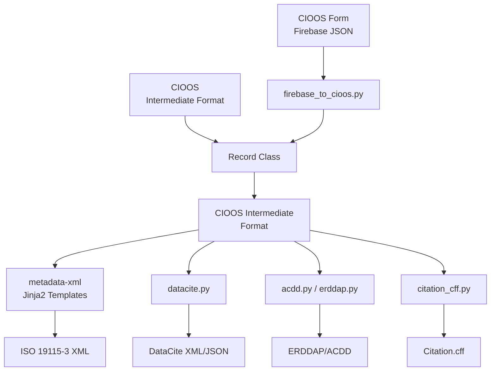

# Architecture

This document describes the architecture and design of the CIOOS Metadata Conversion tool.

## Overview

The tool follows a **two-stage conversion pipeline** architecture:

```
Input Format → CIOOS Intermediate Format → Output Format
```

This design provides several benefits:

- **Consistency**: Single source of truth for all conversions
- **Maintainability**: Changes to standards only affect one conversion path
- **Extensibility**: New formats only need to convert from/to CIOOS intermediate
- **Testability**: Each stage can be tested independently

## System Architecture



## Core Components

### 1. Input Processing

#### firebase_to_cioos.py

Transforms CIOOS Form (Firebase) exports to CIOOS intermediate format.

**Responsibilities**:
- Field restructuring
- Type conversions
- Data enrichment (licenses, EOV translations)
- Coordinate transformations
- Contact processing
- Empty value removal

**Key Functions**:
- `record_json_to_yaml(record)`: Main transformation function
- `fix_lat_long_polygon(polygon)`: Coordinate transformation
- `format_taxa(taxa)`: Taxa keyword flattening
- `eovs_to_fr(eovs_en)`: EOV translation

#### record.py

Main interface for loading and converting metadata records.

**Classes**:
- `Record`: Handles loading, schema conversion, and output generation
- `InputSchemas`: Enum of supported input schemas
- `OUTPUT_FORMATS`: Dict mapping format names to converter functions

**Methods**:
- `load()`: Load metadata from file, URL, or dict
- `convert_to_cioos_schema()`: Convert input to CIOOS intermediate
- `convert_to(format)`: Convert to target format

### 2. CIOOS Intermediate Format

The canonical representation used for all conversions.

**Structure**:
```yaml
metadata:      # About the metadata
spatial:       # Geographic extent
identification: # Resource description
contact:       # Responsible parties
distribution:  # Access information
platform:      # Platform/instruments (optional)
```

**Features**:
- Bilingual support throughout
- Normalized data types
- Clean, minimal structure (no empty values)
- Self-contained (includes all needed lookups)

### 3. Output Converters

#### xml.py + metadata-xml

Generates ISO 19115-3 XML using Jinja2 templates.

**External Dependency**: `metadata-xml` package from GitHub

**Process**:
1. Load CIOOS record
2. Pass to Jinja2 template
3. Render XML
4. Indent and format

**Key Templates** (in metadata-xml repo):
- `main.j2`: Main template
- `contact.j2`: Responsible party handling
- `bilingual.j2`: Multilingual text macros

#### datacite.py

Generates DataCite 4.5 metadata.

**Outputs**: XML and JSON formats

**Key Functions**:
- `to_xml(record)`: Generate DataCite XML
- `to_json(record)`: Generate DataCite JSON
- `_get_creators(record)`: Process creators
- `_get_contributors(record)`: Process contributors
- `_scrub_empty(obj)`: Clean empty values

**Mappings**: See [CIOOS to DataCite](mappings/cioos-to-datacite.md)

#### acdd.py + erddap.py

Generates ACDD 1.3 attributes for ERDDAP and NetCDF.

**acdd.py**:
- `acdd(record)`: Generate ACDD attributes dict
- `acdd_json(record)`: JSON output
- `acdd_yaml(record)`: YAML output

**erddap.py**:
- `global_attributes(record)`: Generate ERDDAP XML
- `update_dataset_xml()`: Update existing datasets.xml

**Features**:
- Multilingual attribute support
- Vocabulary-based keywords
- Platform/instrument metadata

#### citation_cff.py

Generates Citation File Format.

**Uses**: `cffconvert` library for CFF generation

## Data Flow

### 1. Loading Phase

```python
record = Record(source="record.yaml", schema="CIOOS")
record.load()
```

**Process**:
1. Detect source type (file, URL, dict)
2. Load data (JSON or YAML)
3. Store in `record.metadata`

### 2. Schema Conversion

```python
record.convert_to_cioos_schema()
```

**For CIOOS Schema**:
- No conversion needed
- Data already in correct format

**For Firebase Schema**:
- Call `firebase_to_cioos.record_json_to_yaml()`
- Transform structure, enrich data
- Store result in `record.metadata`

### 3. Output Generation

```python
xml = record.convert_to("iso19115-3_xml")
```

**Process**:
1. Lookup converter in `OUTPUT_FORMATS` dict
2. Pass `record.metadata` to converter
3. Generate and return output string

## Resource Files

Located in `cioos_metadata_conversion/resources/`:

### licenses.json

License code to full license information.

**Structure**:
```json
{
  "CC-BY-4.0": {
    "title": {"en": "..."},
    "url": "...",
    "code": "CC-BY-4.0"
  }
}
```

**Used by**: firebase_to_cioos.py

### eov.json

EOV (Essential Ocean Variables) translations.

**Structure**:
```json
[
  {
    "value": "oxygen",
    "label EN": "Oxygen",
    "label FR": "Oxygène",
    ...
  }
]
```

**Used by**: firebase_to_cioos.py for French translations

### epsg.json

EPSG coordinate reference system definitions.

**Used by**: firebase_to_cioos.py for vertical extent CRS

## CLI Layer

### __main__.py

Command-line interface using Click framework.

**Commands**:
- `convert`: Main conversion command
- `erddap-update`: ERDDAP datasets.xml updater

**Key Functions**:
- `cli()`: Main CLI entry point
- `cli_convert()`: Convert command handler
- `convert()`: Core conversion logic
- `load()`: Helper to load records

## Testing Architecture

### Test Structure

```
tests/
├── test_datacite.py      # DataCite conversion tests
├── test_erddap.py        # ERDDAP tests
├── test_xml.py           # ISO 19115-3 tests
├── test_acdd.py          # ACDD tests
└── records/              # Test data
    ├── firebase/         # Firebase exports
    └── *.yaml            # CIOOS records
```

### Test Fixtures

**conftest.py**: Shared fixtures
- `record`: Load test CIOOS record
- `firebase_record`: Load test Firebase record

### Test Patterns

1. **Unit Tests**: Test individual functions
2. **Integration Tests**: Test full conversion pipeline
3. **Validation Tests**: Verify output against schemas

## Extension Points

### Adding New Input Schema

1. Add to `InputSchemas` enum
2. Create conversion function
3. Update `convert_to_cioos_schema()` method
4. Add tests

### Adding New Output Format

1. Create converter module (e.g., `my_format.py`)
2. Add to `OUTPUT_FORMATS` dict in `record.py`
3. Document mapping in `docs/mappings/`
4. Add tests

Example:

```python
# cioos_metadata_conversion/my_format.py
def to_my_format(record: dict) -> str:
    """Convert CIOOS record to My Format."""
    # Implementation
    pass

# cioos_metadata_conversion/record.py
OUTPUT_FORMATS = {
    # ...existing formats...
    "my_format": my_format.to_my_format,
}
```

### Modifying Transformations

**For Firebase → CIOOS**:
Edit `firebase_to_cioos.py`

**For CIOOS → ISO 19115-3**:
Edit templates in `metadata-xml` repo

**For CIOOS → DataCite**:
Edit `datacite.py`

**For CIOOS → ACDD/ERDDAP**:
Edit `acdd.py` or `erddap.py`

## Design Decisions

### Why Two-Stage Pipeline?

**Alternatives Considered**:
- Direct conversion (Firebase → each standard)
- Multi-stage pipeline with multiple intermediates

**Chosen Approach**: Two-stage via CIOOS intermediate

**Rationale**:
- **Simplicity**: One intermediate format vs. many
- **Maintainability**: Changes isolated to one conversion
- **Extensibility**: Easy to add formats
- **Testability**: Test each stage independently

### Why External metadata-xml Package?

**Rationale**:
- ISO 19115-3 is complex
- Separate package allows independent updates
- Reusable by other projects
- Jinja2 templates easier to maintain than code

### Why Not Use XML Libraries for ISO 19115-3?

**Rationale**:
- Jinja2 templates more readable
- Easier for non-developers to modify
- Clear separation of data and presentation
- Better handling of optional elements

## Performance Considerations

### Bottlenecks

1. **XML Generation**: Jinja2 rendering can be slow for large records
2. **File I/O**: Loading many records from disk
3. **JSON Parsing**: Large Firebase exports

### Optimizations

- Use `scrub_dict()` to remove empty values early
- Cache resource file loads (licenses, EOV, EPSG)
- Batch processing for multiple files

### Scalability

**Current**: Suitable for ~10,000 records
**Bottleneck**: Memory for large batches
**Solution**: Process in chunks or use streaming

## Dependencies

### Core Dependencies

- **Python**: 3.11+
- **loguru**: Logging
- **click**: CLI framework
- **pyyaml**: YAML parsing
- **lxml**: XML processing
- **requests**: HTTP client

### Format-Specific

- **datacite**: DataCite utilities
- **cffconvert**: CFF generation
- **metadata-xml**: ISO 19115-3 generation

### Development

- **pytest**: Testing
- **ruff**: Linting/formatting
- **mkdocs-material**: Documentation

## Future Enhancements

### Planned

1. **Schema validation**: Validate input/output against schemas
2. **Async processing**: Parallel conversion of multiple records
3. **Plugin system**: Allow third-party format converters
4. **Web API**: REST API for conversions
5. **Validation reports**: Detailed validation feedback

### Under Consideration

- **Additional formats**: DCAT, Schema.org
- **Transformation hooks**: Custom field transformations
- **Template system**: User-provided templates
- **Batch processing**: Built-in batch utilities

## See Also

- [Contributing Guide](contributing.md) - How to contribute
- [Mappings Documentation](mappings/index.md) - Field mappings
- [API Reference](api/record.md) - API documentation
