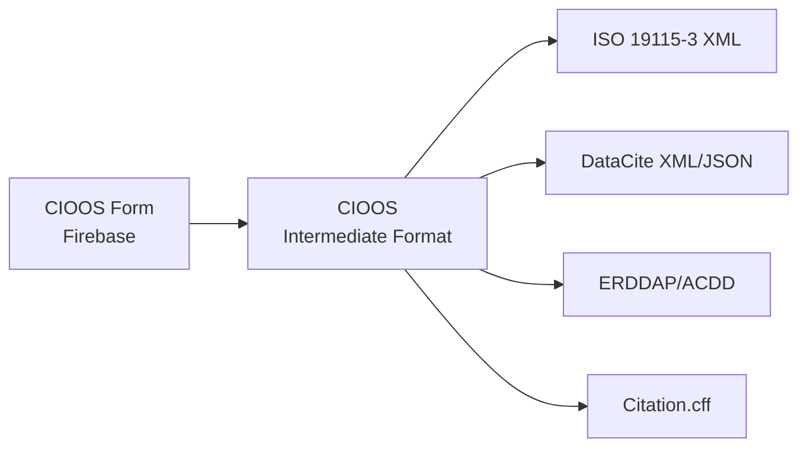

# CIOOS Metadata Conversion

Welcome to the documentation for **CIOOS Metadata Conversion**, a comprehensive tool for converting ocean metadata records between various international standards and formats.

## Overview

This project provides a robust solution for transforming metadata from the CIOOS (Canadian Integrated Ocean Observing System) metadata entry form into widely recognized international metadata standards. It facilitates data sharing, discovery, and citation by bridging the gap between the CIOOS metadata profile and global metadata standards.

## Key Features

- **Multiple Output Formats**: Convert to ISO 19115-3 XML, DataCite JSON/XML, ERDDAP/ACDD attributes, Citation.cff, and more
- **Bidirectional Support**: Works with both CIOOS intermediate format and Firebase-based form data
- **Bilingual Metadata**: Full support for English and French metadata
- **Automated Enrichment**: Automatic translation of EOV codes, license resolution, coordinate transformations
- **CLI and Python API**: Use as a command-line tool or integrate into your Python applications
- **Extensible Design**: Easy to add new output formats and transformations

## Supported Standards

### Input Schemas

- **CIOOS**: The canonical CIOOS intermediate format
- **Firebase**: Direct from CIOOS metadata entry form

### Output Formats

| Format | Description | Use Case |
|--------|-------------|----------|
| `iso19115-3_xml` | ISO 19115-3:2016 Geographic Information Metadata | Standard for geospatial metadata, catalog harvesting |
| `datacite_xml` | DataCite Metadata Schema 4.5 XML | Research data citation, DOI registration |
| `datacite_json` | DataCite Metadata Schema 4.5 JSON | Programmatic data citation |
| `erddap` | ERDDAP datasets.xml attributes | ERDDAP data server integration |
| `acdd_json` | ACDD 1.3 global attributes (JSON) | NetCDF Climate and Forecast conventions |
| `acdd_yaml` | ACDD 1.3 global attributes (YAML) | Human-readable ACDD attributes |
| `cff` | Citation File Format | Software and dataset citation |
| `json` | CIOOS intermediate format (JSON) | Data exchange, processing |
| `yaml` | CIOOS intermediate format (YAML) | Human-readable format |

## Quick Example

```bash
# Convert a CIOOS intermediate format record to ISO 19115-3 XML
cioos_metadata_conversion convert \
  --input record.yaml \
  --input-schema CIOOS \
  --output-format iso19115-3_xml \
  --output-file record.xml

# Convert Firebase JSON to DataCite XML
cioos_metadata_conversion convert \
  --input firebase-record.json \
  --input-schema firebase \
  --output-format datacite_xml \
  --output-file datacite.xml
```

## Python API Example

```python
from cioos_metadata_conversion.record import Record

# Load and convert a record
record = Record(source="record.yaml", schema="CIOOS")
record.load().convert_to_cioos_schema()

# Convert to different formats
iso_xml = record.convert_to("iso19115-3_xml")
datacite_json = record.convert_to("datacite_json")
acdd_attrs = record.convert_to("acdd_yaml")
```

## Architecture

The conversion process follows a two-stage pipeline:

1. **Input to CIOOS**: Source data (Firebase or CIOOS) → CIOOS intermediate format
2. **CIOOS to Output**: CIOOS intermediate format → Target standard



This two-stage approach ensures:

- **Consistency**: Single source of truth for transformations
- **Maintainability**: Changes to standards only affect one conversion path
- **Extensibility**: New formats only need to convert from CIOOS intermediate format

## Use Cases

### Data Catalog Integration

Convert CIOOS metadata to ISO 19115-3 for harvesting into international data catalogs like:

- Ocean Data and Information Network (ODIN)
- Global Change Master Directory (GCMD)
- GEOSS Portal

### DOI Registration

Generate DataCite metadata for registering Digital Object Identifiers (DOIs) for datasets.

### Data Server Configuration

Automatically update ERDDAP server configurations with standardized metadata attributes.

### Dataset Citation

Create Citation File Format (CFF) files for proper dataset attribution and citation.

## Next Steps

- [Installation Guide](installation.md) - Get started with installation
- [Quick Start](quickstart.md) - Jump right into using the tool
- [CLI Reference](cli.md) - Detailed command-line interface documentation
- [Mappings Overview](mappings/index.md) - Understand field mappings between formats

## Contributing

We welcome contributions! This project is open source and available on [GitHub](https://github.com/cioos-siooc/cioos-metadata-conversion). See our [Contributing Guide](contributing.md) for more information.

## License

This project is licensed under the MIT License - see the LICENSE file for details.

## Support

For issues, questions, or feature requests, please:

- Open an issue on [GitHub](https://github.com/cioos-siooc/cioos-metadata-conversion/issues)
- Check the documentation for guides and references
- Review the [mappings documentation](mappings/index.md) for field-level details
