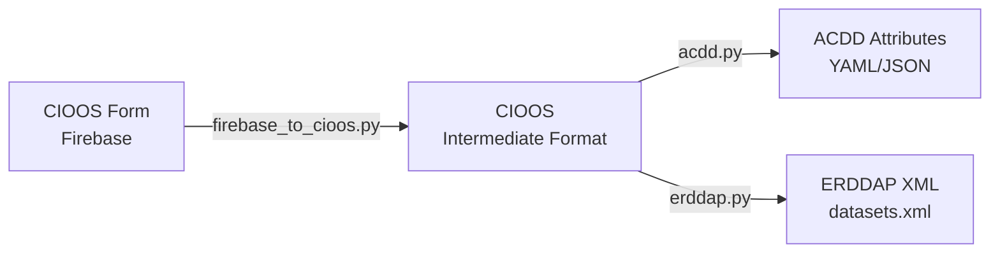

# CIOOS Form to ERDDAP/ACDD Mapping

This document describes how CIOOS Form metadata fields are converted to ERDDAP global attributes following the ACDD 1.3 (Attribute Convention for Data Discovery) standard.

## Quick Reference

| Purpose | Use This Section |
|---------|------------------|
| Understand the conversion process | [Overview](#overview) |
| Learn about multilingual options | [Multilingual Support](#multilingual-support) |
| Find specific attribute mappings | [Attribute Mappings](#attribute-mappings) |
| See examples | [Usage Examples](#usage-examples) |
| Update ERDDAP servers | [ERDDAP Integration](#erddap-integration) |

---

## Overview

### What is ACDD?

**ACDD** (Attribute Convention for Data Discovery) is a standard set of global attributes that enhance data discovery and interoperability in Earth science datasets. ERDDAP data servers use these attributes to provide rich, searchable metadata.

**Standard Version**: ACDD 1.3
**Reference**: http://wiki.esipfed.org/index.php/ACDD_1-3

### Conversion Pipeline

The conversion follows a two-stage process:



1. **Stage 1**: CIOOS Form → CIOOS Intermediate Format
2. **Stage 2**: CIOOS → ACDD/ERDDAP

### Output Formats

| Format | Description | Use Case |
|--------|-------------|----------|
| **Python dict** | Dictionary of attributes | Programmatic use |
| **JSON** | JSON string | API integration |
| **YAML** | YAML string | Human-readable config |
| **XML** | ERDDAP `<addAttributes>` | ERDDAP datasets.xml |

---

## Multilingual Support

ACDD/ERDDAP conversion supports three methods for bilingual (English/French) metadata:

### Method 1: Suffix

Separate attributes for each language.

```yaml
title_en: "Ocean Temperature Monitoring"
title_fr: "Surveillance de la température océanique"
summary_en: "Temperature measurements..."
summary_fr: "Mesures de température..."
```

**Best for**: NetCDF files, simple ERDDAP configurations

### Method 2: Nested

Combined in single attribute with language tags.

```yaml
title: "(en) Ocean Temperature Monitoring; (fr) Surveillance de la température océanique"
summary: "(en) Temperature measurements...; (fr) Mesures de température..."
```

**Best for**: Compact representation, single-field displays

### Method 3: XML

Uses XML `xml:lang` attributes.

```xml
<att name="title" xml:lang="en">Ocean Temperature Monitoring</att>
<att name="title" xml:lang="fr">Surveillance de la température océanique</att>
```

**Best for**: ERDDAP servers, standards compliance

---

## Attribute Mappings

### 📋 Core Identification

#### id

| | |
|---|---|
| **ACDD Attribute** | `id` |
| **CIOOS Source** | `metadata.identifier` |
| **CIOOS Form Field** | `identifier` |
| **Required** | ✅ Yes |
| **Type** | String (UUID) |
| **Example** | `"fb5c9e1e-a911-46b7-8c1d-e34215a105ed"` |

Unique identifier for the metadata record.

#### naming_authority

| | |
|---|---|
| **ACDD Attribute** | `naming_authority` |
| **CIOOS Source** | `metadata.naming_authority` |
| **CIOOS Form Field** | (auto-assigned) |
| **Required** | ✅ Yes |
| **Type** | String |
| **Default** | `"ca.cioos"` |

Organization responsible for the naming convention.

#### title

| | |
|---|---|
| **ACDD Attribute** | `title` (+ `title_en`, `title_fr` with suffix method) |
| **CIOOS Source** | `identification.title` |
| **CIOOS Form Field** | `title.en`, `title.fr` |
| **Required** | ✅ Yes |
| **Type** | String |
| **Multilingual** | ✅ Yes |

Descriptive title for the dataset.

**Example**:
```yaml
# Suffix method
title_en: "Strait of Georgia Ocean Monitoring"
title_fr: "Surveillance océanique du détroit de Géorgie"

# XML method
<att name="title" xml:lang="en">Strait of Georgia Ocean Monitoring</att>
<att name="title" xml:lang="fr">Surveillance océanique du détroit de Géorgie</att>
```

#### summary

| | |
|---|---|
| **ACDD Attribute** | `summary` (+ `summary_en`, `summary_fr` with suffix method) |
| **CIOOS Source** | `identification.abstract` |
| **CIOOS Form Field** | `abstract.en`, `abstract.fr` |
| **Required** | ✅ Yes |
| **Type** | String (paragraph) |
| **Multilingual** | ✅ Yes |

Paragraph describing the dataset, its collection, and purpose.

---

### 👥 Contact and Attribution

#### institution

| | |
|---|---|
| **ACDD Attribute** | `institution` |
| **CIOOS Source** | `contact[].organization.name` (where `owner` in roles) |
| **CIOOS Form Field** | `contacts[].orgName` (role: `owner`) |
| **Required** | Recommended |
| **Type** | String |

Institution responsible for the dataset (primary data owner).

**Note**: Uses first owner if multiple exist.

#### Creator Attributes

Describes the person or organization that created the dataset.

| ACDD Attribute | CIOOS Source | CIOOS Form Field | Description |
|----------------|--------------|------------------|-------------|
| `creator_name` | `contact[].individual.name` or `organization.name` | `lastName`, `givenNames` or `orgName` | Creator's name |
| `creator_email` | `contact[].individual.email` or `organization.email` | `indEmail` or `orgEmail` | Email address |
| `creator_orcid` | `contact[].individual.orcid` | `indOrcid` | ORCID identifier |
| `creator_type` | (derived) | (role: `owner`) | `"person"` or `"institution"` |
| `creator_institution` | `contact[].organization.name` | `orgName` | Institution affiliation |
| `creator_address` | `contact[].organization.address` | `orgAdress` | Street address |
| `creator_city` | `contact[].organization.city` | `orgCity` | City |
| `creator_country` | `contact[].organization.country` | `orgCountry` | Country |
| `creator_url` | `contact[].organization.url` | `orgURL` | Website URL |
| `creator_ror` | `contact[].organization.ror` | `orgRor` | ROR identifier |

**Selection Logic**:
1. Find contacts with `owner` role
2. If contact has individual info → `creator_type: "person"`, use individual name
3. If only organization → `creator_type: "institution"`, use org name
4. Always include organization affiliation details

**Example**:
```yaml
creator_name: "Doe, Jane"
creator_email: "jane.doe@marine-research.ca"
creator_orcid: "https://orcid.org/0000-0001-2345-6789"
creator_type: "person"
creator_institution: "Marine Research Institute"
creator_country: "Canada"
creator_ror: "https://ror.org/01234abcd"
```

#### Publisher Attributes

Same structure as creator attributes, but for contacts with `publisher` role:

`publisher_name`, `publisher_email`, `publisher_type`, `publisher_institution`, `publisher_address`, `publisher_city`, `publisher_country`, `publisher_url`, `publisher_ror`

#### contributor_name & contributor_role

| | |
|---|---|
| **ACDD Attributes** | `contributor_name`, `contributor_role` |
| **CIOOS Source** | `contact[]` (all contacts) |
| **CIOOS Form Field** | `contacts` array |
| **Type** | Semicolon-separated lists |

All contacts listed with their roles.

**Format**:
```yaml
contributor_name: "Doe, Jane; Marine Research Institute; Smith, John"
contributor_role: "owner,pointOfContact; publisher; distributor,editor"
```

Each contact separated by `;`, multiple roles per contact separated by `,`.

---

### 📅 Temporal Information

#### date_created

| | |
|---|---|
| **ACDD Attribute** | `date_created` |
| **CIOOS Source** | `metadata.dates.publication` |
| **CIOOS Form Field** | `timeFirstPublished` |
| **Type** | ISO 8601 date |
| **Example** | `"2024-03-15"` |

Date when the dataset was first published.

#### date_modified

| | |
|---|---|
| **ACDD Attribute** | `date_modified` |
| **CIOOS Source** | `metadata.dates.revision` |
| **CIOOS Form Field** | `created` (last modification timestamp) |
| **Type** | ISO 8601 date |
| **Example** | `"2024-11-21"` |

Date of last metadata revision.

---

### 🔬 Scientific Information

#### keywords

| | |
|---|---|
| **ACDD Attribute** | `keywords` |
| **CIOOS Source** | `identification.keywords` (all groups) |
| **CIOOS Form Field** | `keywords`, `eov`, `taxa` |
| **Type** | Comma-separated list with prefixes |

Combined keywords from all sources with prefixes indicating their vocabulary.

**Prefix System**:

| Keyword Type | Prefix | Example |
|--------------|--------|---------|
| Free keywords | (none) | `ocean temperature,salinity,nutrients` |
| Essential Ocean Variables | `CIOOS:` | `CIOOS:Oxygen,CIOOS:Sea Surface Temperature` |
| Taxa (GBIF) | `GBIF:` | `GBIF:Animalia,GBIF:Mollusca,GBIF:Gastropoda` |

**Full Example**:
```yaml
keywords: "ocean temperature,salinity,CIOOS:Oxygen,CIOOS:Nutrients,GBIF:Animalia,GBIF:Mollusca"
```

**Special Processing**:
- EOV values converted from camelCase to Title Case
- Taxa flattened from hierarchical GBIF taxonomy
- All keywords comma-separated in single attribute

#### keywords_vocabulary

| | |
|---|---|
| **ACDD Attribute** | `keywords_vocabulary` |
| **CIOOS Source** | (derived from keyword groups present) |
| **Type** | Comma-separated vocabulary labels |

Lists vocabularies used with their prefixes.

**Example**:
```yaml
keywords_vocabulary: "CIOOS:CIOOS Essential Ocean Variables Vocabulary,GBIF:GBIF Taxonomy Vocabulary"
```

#### project

| | |
|---|---|
| **ACDD Attribute** | `project` |
| **CIOOS Source** | `identification.project` |
| **CIOOS Form Field** | `projects` |
| **Type** | Comma-separated list |
| **Example** | `"Ocean Observing Initiative,Coastal Monitoring Program"` |

Research projects associated with the dataset.

#### progress

| | |
|---|---|
| **ACDD Attribute** | `progress` |
| **CIOOS Source** | `identification.progress_code` |
| **CIOOS Form Field** | `progress` |
| **Type** | String (code) |
| **Values** | `completed`, `onGoing`, `planned`, `obsolete`, etc. |

**Note**: This is a CIOOS-specific extension, not standard ACDD.

---

### 🚢 Platform and Instruments

#### platform

| | |
|---|---|
| **ACDD Attribute** | `platform` |
| **CIOOS Source** | `platform[0].type` |
| **CIOOS Form Field** | `platforms[0].type` |
| **Type** | String |
| **Example** | `"coastal structure"`, `"research vessel"` |

Type of platform used for data collection (first platform only).

#### platform_vocabulary

| | |
|---|---|
| **ACDD Attribute** | `platform_vocabulary` |
| **CIOOS Source** | (hardcoded) |
| **Value** | `"http://vocab.nerc.ac.uk/collection/L06/current/"` |

NERC vocabulary URL for platform types.

---

### 📝 Version and History

#### product_version

| | |
|---|---|
| **ACDD Attribute** | `product_version` |
| **CIOOS Source** | `identification.edition` |
| **CIOOS Form Field** | `edition` |
| **Type** | String |
| **Example** | `"1.0.0"`, `"v2.1"` |

Version identifier for the dataset.

#### history

| | |
|---|---|
| **ACDD Attribute** | `history` |
| **CIOOS Source** | `metadata.history` |
| **CIOOS Form Field** | `history` |
| **Type** | String (formatted) |
| **Multilingual** | ✅ Yes |

Audit trail for dataset modifications.

**Format** (when structured):
```yaml
history: |
  Metadata record history:
  - scope: Dataset
    statement:
      en: "Data collected from coastal monitoring stations..."
      fr: "Données collectées des stations de surveillance côtières..."
```

---

### ⚖️ Legal and Usage

#### license

| | |
|---|---|
| **ACDD Attribute** | `license` |
| **CIOOS Source** | `metadata.use_constraints.licence.url` |
| **CIOOS Form Field** | `license` (code resolved via `licenses.json`) |
| **Type** | URL |
| **Example** | `"https://creativecommons.org/licenses/by/4.0"` |

URL to the license governing dataset use.

**License Code Resolution**:
```
CC-BY-4.0 → https://creativecommons.org/licenses/by/4.0
CC0 → https://creativecommons.org/publicdomain/zero/1.0/
OGL-Canada-2.0 → https://open.canada.ca/en/open-government-licence-canada
```

#### comment

| | |
|---|---|
| **ACDD Attribute** | `comment` |
| **CIOOS Source** | `metadata.use_constraints.limitations` + translation info |
| **CIOOS Form Field** | `limitations` |
| **Type** | String (formatted) |
| **Multilingual** | ✅ Yes |

Miscellaneous information, limitations, and usage notes.

**Format**:
```yaml
comment: |
  ##Limitations:
  Data should not be used for navigation purposes.

  ##Translation:
  text translated using the Amazon translate service / texte traduit à l'aide du service de traduction Amazon
```

---

### 🔗 References and Links

#### doi

| | |
|---|---|
| **ACDD Attribute** | `doi` |
| **CIOOS Source** | `identification.identifier` |
| **CIOOS Form Field** | `datasetIdentifier` |
| **Type** | URL |
| **Example** | `"https://doi.org/10.26071/mxtr-gp72"` |

Digital Object Identifier for the dataset.

#### metadata_link

| | |
|---|---|
| **ACDD Attribute** | `metadata_link` |
| **CIOOS Source** | `identification.identifier` or provided parameter |
| **CIOOS Form Field** | `datasetIdentifier` |
| **Type** | URL |

URL to the complete metadata record.

#### metadata_form

| | |
|---|---|
| **ACDD Attribute** | `metadata_form` |
| **CIOOS Source** | `metadata.maintenance_note` |
| **CIOOS Form Field** | (derived from form URL) |
| **Type** | URL |
| **Example** | `"https://cioos-siooc.github.io/metadata-entry-form#/en/stlaurent/..."` |

Link to the form used to create this metadata.

**Note**: This is a CIOOS-specific extension, not standard ACDD.

---

## ERDDAP Integration

### Dataset Matching

ERDDAP datasets are matched to CIOOS metadata by:

1. **Distribution URL matching**: Look for `distribution[].url` containing the ERDDAP URL
2. **Dataset ID extraction**: Extract dataset ID from URL (segment before `.html`)
3. **Subset filtering**: Ignore URLs with query parameters (`?`)

**Example**:
```
CIOOS distribution URL: https://data.example.org/erddap/tabledap/my_dataset.html
ERDDAP dataset ID: my_dataset
```

### XML Structure

Generated ERDDAP XML uses `<addAttributes>` blocks:

```xml
<dataset type="EDDTableFromMultidimNcFiles" datasetID="my_dataset" active="true">
  <!-- Existing configuration preserved -->

  <addAttributes>
    <att name="id">fb5c9e1e-a911-46b7-8c1d-e34215a105ed</att>
    <att name="naming_authority">ca.cioos</att>
    <att name="title" xml:lang="en">Ocean Monitoring</att>
    <att name="title" xml:lang="fr">Surveillance océanique</att>
    <att name="summary" xml:lang="en">Temperature and salinity measurements...</att>
    <att name="summary" xml:lang="fr">Mesures de température et de salinité...</att>
    <att name="keywords">ocean temperature,salinity,CIOOS:Oxygen</att>
    <att name="creator_name">Doe, Jane</att>
    <att name="creator_institution">Marine Research Institute</att>
    <att name="license">https://creativecommons.org/licenses/by/4.0</att>
  </addAttributes>
</dataset>
```

### Update Process

When updating existing `datasets.xml`:

1. ✅ Parse existing XML file
2. ✅ Find datasets by `datasetID` attribute
3. ✅ Update existing `<att>` elements or create new ones
4. ✅ Preserve multilingual attributes using `xml:lang`
5. ✅ Maintain all other configuration (data variables, source URLs, etc.)
6. ✅ Create backup if requested

---

## Usage Examples

### Generate ACDD Attributes (Python Dictionary)

```python
from cioos_metadata_conversion.record import Record
from cioos_metadata_conversion import acdd

# Load CIOOS record
record = Record(source="record.yaml", schema="CIOOS")
record.load().convert_to_cioos_schema()

# Generate ACDD attributes
attributes = acdd.acdd(record.metadata, language="en")

print(attributes['title'])  # "Ocean Temperature Monitoring"
print(attributes['keywords'])  # "ocean temperature,CIOOS:Oxygen,..."
```

### Generate with Suffix Multilingual Method

```python
attributes = acdd.acdd(
    record.metadata,
    language="en",
    multilingual="suffix"
)

print(attributes['title_en'])  # "Ocean Temperature Monitoring"
print(attributes['title_fr'])  # "Surveillance de la température océanique"
print(attributes['summary_en'])  # English summary
print(attributes['summary_fr'])  # French summary
```

### Generate ACDD as JSON

```python
from cioos_metadata_conversion import acdd

json_output = acdd.acdd_json(
    record.metadata,
    language="en",
    multilingual="suffix"
)

# Save to file
with open("attributes.json", "w") as f:
    f.write(json_output)
```

### Generate ACDD as YAML

```python
from cioos_metadata_conversion import acdd

yaml_output = acdd.acdd_yaml(
    record.metadata,
    language="en",
    multilingual="nested"
)

# Save to file
with open("attributes.yaml", "w") as f:
    f.write(yaml_output)
```

### Generate ERDDAP XML

```python
from cioos_metadata_conversion import erddap

xml = erddap.global_attributes(
    record.metadata,
    output="xml",
    multilingual="xml"
)

# XML with xml:lang attributes
print(xml)
```

### Update ERDDAP datasets.xml

```python
from cioos_metadata_conversion.erddap import update_dataset_xml
from cioos_metadata_conversion.record import Record

# Load multiple CIOOS records
records = [
    Record(source="dataset1.yaml", schema="CIOOS").load().convert_to_cioos_schema().metadata,
    Record(source="dataset2.yaml", schema="CIOOS").load().convert_to_cioos_schema().metadata,
]

# Update ERDDAP configuration
update_dataset_xml(
    datasets_xml="/opt/erddap/content/datasets.xml",
    records=records,
    erddap_url="https://data.example.org/erddap",
    multilingual=True,
    backup=True  # Create backup first
)
```

### CLI: Convert to ACDD YAML

```bash
cioos_metadata_conversion convert \
  --input record.yaml \
  --input-schema CIOOS \
  --output-format acdd_yaml \
  --output-file attributes.yaml
```

### CLI: Update ERDDAP Server

```bash
cioos_metadata_conversion erddap-update \
  --datasets-xml /opt/erddap/content/datasets.xml \
  --records "cioos-records/*.yaml" \
  --erddap-url "https://data.example.org/erddap" \
  --multilingual \
  --backup
```

---

## Fields Not Mapped

The following CIOOS Form fields are **not** currently mapped to ACDD/ERDDAP:

### Geographic Information
- ❌ Bounding box coordinates (west, east, north, south)
- ❌ Polygon geometry
- ❌ Vertical extent (depth/height ranges)
- ❌ Spatial description and identifiers

### Temporal Coverage
- ❌ Data collection start date (`dateStart`)
- ❌ Data collection end date (`dateEnd`)

**Note**: `date_created` and `date_modified` are metadata dates, not data coverage dates.

### Associated Resources
- ❌ Related publications (with DOI)
- ❌ Related datasets
- ❌ Association types (IsReferencedBy, IsCitedBy, etc.)

### Distribution
- ❌ Download URLs (except ERDDAP URL for matching)
- ❌ Distribution format information
- ❌ Distribution descriptions

### Instruments
- ❌ Detailed instrument specifications
- ❌ Instrument-platform relationships
- ❌ Multiple instruments per platform

### Quality Assurance
- ❌ Quality control procedures
- ❌ Processing steps
- ❌ Lineage source datasets

### Workflow Fields
- ❌ Internal identifiers (recordID, userID, region)
- ❌ DOI creation status
- ❌ Form workflow status
- ❌ Last edited by information

---

## Special Processing Notes

### 🔄 Automatic Distributor Assignment

If no contact has the `distributor` role, the system automatically adds this role to all contacts with the `owner` role.

### ⚠️ Multiple Creators/Publishers Warning

If multiple contacts have `owner` or `publisher` roles, only the first one is used. A warning is logged.

**Best Practice**: Designate one primary owner/publisher and use other roles (contributor, collaborator) for additional parties.

### 🏷️ Keyword Prefix Rules

| Source | Prefix | Applied When |
|--------|--------|--------------|
| `keywords.en`, `keywords.fr` | (none) | Free-text keywords |
| `eov` | `CIOOS:` | Essential Ocean Variables |
| `taxa` | `GBIF:` | Taxonomic information from GBIF |

### 🧹 Empty Value Removal

All empty strings, null values, and empty objects are automatically removed from the final output using `drop_empty_values()`.

### 🌍 Language Selection

The `language` parameter determines which language version is used for bilingual fields when generating single-language output. Use `multilingual` parameter for including both languages.

---

## Reference

### File Locations

| Component | File Path |
|-----------|-----------|
| ACDD conversion | `cioos_metadata_conversion/acdd.py` |
| ERDDAP integration | `cioos_metadata_conversion/erddap.py` |
| Form to CIOOS transform | `cioos_metadata_conversion/firebase_to_cioos.py` |
| Unit tests | `tests/test_acdd.py`, `tests/test_erddap.py` |
| Test ERDDAP XML | `tests/erddap_xmls/test_datasets.xml` |

### Related Documentation

- [ACDD 1.3 Standard](http://wiki.esipfed.org/index.php/ACDD_1-3) - Official ACDD specification
- [ERDDAP Documentation](https://coastwatch.pfeg.noaa.gov/erddap/download/setup.html) - ERDDAP server setup
- [Field Mapping Summary](field-mapping-summary.md) - Complete cross-format comparison
- [CIOOS Form Schema](../cioos-form-schema.md) - Form field reference
- [Usage Guide](../usage.md) - General conversion examples

### Function Reference

| Function | Purpose | Returns |
|----------|---------|---------|
| `acdd.acdd(record, language, multilingual)` | Generate ACDD attributes | dict |
| `acdd.acdd_json(record, language, multilingual)` | Generate as JSON | str |
| `acdd.acdd_yaml(record, language, multilingual)` | Generate as YAML | str |
| `erddap.global_attributes(record, output, multilingual)` | Generate ERDDAP XML | str |
| `erddap.update_dataset_xml(datasets_xml, records, erddap_url, multilingual, backup)` | Update datasets.xml | None |
