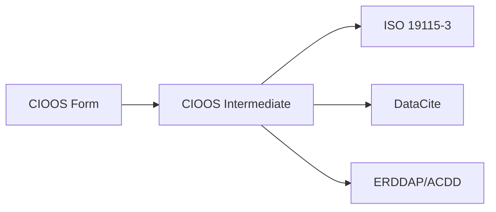

# Field Mapping Summary

This page provides a comprehensive overview of how CIOOS Form fields map across all output formats.

## Architecture Overview

The CIOOS metadata conversion follows a **two-stage pipeline**:

1. **Stage 1**: CIOOS Form (Firebase) → CIOOS Intermediate Format
2. **Stage 2**: CIOOS Intermediate Format → Output Formats

This architecture ensures consistency and makes it easy to add new output formats.

## Complete Field Mapping Table

### Identification & Metadata

| CIOOS Form Field | CIOOS Intermediate | ISO 19115-3 | DataCite | ERDDAP/ACDD |
|------------------|-------------------|-------------|----------|-------------|
| `identifier` (UUID) | `metadata.identifier` | `mdb:metadataIdentifier/mcc:code` | - | `id` |
| `datasetIdentifier` (DOI) | `identification.identifier` | `mri:citation/cit:identifier` | `identifier` | `doi` |
| (auto) | `metadata.naming_authority` | `mdb:metadataIdentifier/mcc:authority` | - | `naming_authority` |
| `language` | `metadata.language` | `mdb:defaultLocale` | `language` | - |
| `metadataScope` | `metadata.scope` | `mdb:metadataScope` | `resourceTypeGeneral` | - |
| `created` | `metadata.dates.revision` | `mdb:dateInfo` (revision) | `dates[].Updated` | `date_modified` |
| `timeFirstPublished` | `metadata.dates.publication` | `mdb:dateInfo` (publication) | `publicationYear` | `date_created` |

### Title & Description

| CIOOS Form Field | CIOOS Intermediate | ISO 19115-3 | DataCite | ERDDAP/ACDD |
|------------------|-------------------|-------------|----------|-------------|
| `title.en` | `identification.title.en` | `mri:citation/cit:title` (PT_FreeText) | `titles[].title` (lang="en") | `title_en` / `title` |
| `title.fr` | `identification.title.fr` | `mri:citation/cit:title` (PT_FreeText) | `titles[].title` (lang="fr") | `title_fr` |
| `abstract.en` | `identification.abstract.en` | `mri:abstract` (PT_FreeText) | `descriptions[].Abstract` (lang="en") | `summary_en` / `summary` |
| `abstract.fr` | `identification.abstract.fr` | `mri:abstract` (PT_FreeText) | `descriptions[].Abstract` (lang="fr") | `summary_fr` |
| `edition` | `identification.edition` | `cit:edition` | `version` | `product_version` |
| `comment` | `metadata.comment` | `mri:supplementalInformation` | - | `comment` |
| `limitations` | `metadata.use_constraints.limitations` | `mco:useLimitation` | `descriptions[].Other` | `comment` (prefixed) |

### Contacts & Contributors

| CIOOS Form Field | CIOOS Intermediate | ISO 19115-3 | DataCite | ERDDAP/ACDD |
|------------------|-------------------|-------------|----------|-------------|
| `contacts[].lastName` | `contact[].individual.name` | `cit:CI_Individual/cit:name` | `creatorName` (Personal) | `creator_name` |
| `contacts[].givenNames` | `contact[].individual.name` | (combined with lastName) | (combined with lastName) | - |
| `contacts[].indPosition` | `contact[].individual.position` | `cit:positionName` | - | - |
| `contacts[].indEmail` | `contact[].individual.email` | `cit:electronicMailAddress` | - | `creator_email` |
| `contacts[].indOrcid` | `contact[].individual.orcid` | `cit:onlineResource` | `nameIdentifier` (ORCID) | `creator_orcid` |
| `contacts[].orgName` | `contact[].organization.name` | `cit:CI_Organisation/cit:name` | `creatorName` / `affiliation` | `creator_institution` |
| `contacts[].orgEmail` | `contact[].organization.email` | `cit:electronicMailAddress` | - | `publisher_email` |
| `contacts[].orgURL` | `contact[].organization.url` | `cit:onlineResource` | - | `creator_url` |
| `contacts[].orgRor` | `contact[].organization.ror` | `cit:onlineResource` | `affiliationIdentifier` (ROR) | `creator_ror` |
| `contacts[].orgAddress` | `contact[].organization.address` | `cit:address/deliveryPoint` | - | - |
| `contacts[].orgCity` | `contact[].organization.city` | `cit:address/city` | - | - |
| `contacts[].orgCountry` | `contact[].organization.country` | `cit:address/country` | - | `publisher_country` |
| `contacts[].role` | `contact[].roles[]` | `cit:role/CI_RoleCode` | Mapped to contributor types | Mapped to attribute prefixes |
| `contacts[].inCitation` | `contact[].inCitation` | `cit:citedResponsibleParty` | Determines `creators` vs `contributors` | - |

**Contact Role Mappings**:

| CIOOS Form Role | ISO 19115-3 Code | DataCite Type | ACDD Prefix |
|-----------------|------------------|---------------|-------------|
| `owner` | `owner` | `RightsHolder` | `publisher_*` |
| `distributor` | `distributor` | `Distributor` | `publisher_*` |
| `pointOfContact` | `pointOfContact` | `ContactPerson` | `contributor_*` |
| `principalInvestigator` | `principalInvestigator` | `ProjectLeader` | `creator_*` |
| `author` | `author` | `Researcher` | `creator_*` |
| `coAuthor` | `coAuthor` | `Researcher` | `creator_*` |
| `processor` | `processor` | `DataCurator` | `contributor_*` |
| `custodian` | `custodian` | `DataCurator` | `contributor_*` |
| `funder` | `funder` | `Funder` | - |
| `sponsor` | `sponsor` | `Sponsor` | - |
| `publisher` | `publisher` | `Publisher` | `publisher_*` |
| `collaborator` | `collaborator` | `Other` | `contributor_*` |
| `contributor` | `contributor` | `Other` | `contributor_*` |

### Temporal Coverage

| CIOOS Form Field | CIOOS Intermediate | ISO 19115-3 | DataCite | ERDDAP/ACDD |
|------------------|-------------------|-------------|----------|-------------|
| `dateStart` | `identification.temporal_begin` | `gex:EX_TemporalExtent/begin` | `dates[].Collected` (range start) | - |
| `dateEnd` | `identification.temporal_end` | `gex:EX_TemporalExtent/end` | `dates[].Collected` (range end) | - |
| `datePublished` | `identification.dates.publication` | `cit:date` (publication) | - | - |
| `dateRevised` | `identification.dates.revision` | `cit:date` (revision) | - | - |

### Geographic Extent

| CIOOS Form Field | CIOOS Intermediate | ISO 19115-3 | DataCite | ERDDAP/ACDD |
|------------------|-------------------|-------------|----------|-------------|
| `map.west` | `spatial.bbox[0]` | `gex:westBoundLongitude` | `geoLocationBox.westBoundLongitude` | - |
| `map.south` | `spatial.bbox[1]` | `gex:southBoundLatitude` | `geoLocationBox.southBoundLatitude` | - |
| `map.east` | `spatial.bbox[2]` | `gex:eastBoundLongitude` | `geoLocationBox.eastBoundLongitude` | - |
| `map.north` | `spatial.bbox[3]` | `gex:northBoundLatitude` | `geoLocationBox.northBoundLatitude` | - |
| `map.polygon` | `spatial.polygon` | `gex:EX_BoundingPolygon` | `geoLocationPolygon` | - |
| `map.description.en` | `spatial.description.en` | `gex:EX_GeographicDescription` | `geoLocationPlace` (en) | - |
| `map.description.fr` | `spatial.description.fr` | `gex:EX_GeographicDescription` | `geoLocationPlace` (fr) | - |
| `map.descriptionIdentifier` | - | `mcc:code` | - | - |

**Coordinate Transformation**: Polygon coordinates transformed from "lat,long" (CIOOS Form) to "long,lat" (standards).

### Vertical Extent

| CIOOS Form Field | CIOOS Intermediate | ISO 19115-3 | DataCite | ERDDAP/ACDD |
|------------------|-------------------|-------------|----------|-------------|
| `verticalExtentMin` | `spatial.vertical[0]` | `gex:minimumValue` | - | - |
| `verticalExtentMax` | `spatial.vertical[1]` | `gex:maximumValue` | - | - |
| `verticalExtentDirection` | `spatial.vertical_positive` | (in reference system) | - | - |
| `verticalExtentEPSG` | `spatial.vertical_epsg` | `mrs:referenceSystemIdentifier` | - | - |
| `noVerticalExtent` | (omit if true) | (not generated) | - | - |

### Keywords & Vocabularies

| CIOOS Form Field | CIOOS Intermediate | ISO 19115-3 | DataCite | ERDDAP/ACDD |
|------------------|-------------------|-------------|----------|-------------|
| `keywords.en[]` | `identification.keywords.default.en[]` | `mri:MD_Keywords` (default) | `subjects[]` (en) | `keywords` |
| `keywords.fr[]` | `identification.keywords.default.fr[]` | `mri:MD_Keywords` (default) | `subjects[]` (fr) | `keywords` |
| `eov[]` | `identification.keywords.eov.en[]` | `mri:MD_Keywords` (eov thesaurus) | `subjects[]` (GOOS EOV) | `keywords` (CIOOS: prefix) |
| (auto-translated) | `identification.keywords.eov.fr[]` | `mri:MD_Keywords` (eov thesaurus) | - | - |
| `taxa[].scientificName` | `identification.keywords.taxa[]` | `mri:MD_Keywords` (taxa thesaurus) | - | `keywords` (GBIF: prefix) |
| `taxa[].kingdom` → `species` | (flattened hierarchy) | (as keywords) | - | (as keywords) |
| `noTaxa` | (omit if true) | (not generated) | - | - |

**EOV Processing**:
- English codes translated to French labels using `eov.json`
- ACDD: Converted from camelCase to Title Case with "CIOOS:" prefix

**Taxa Processing**:
- GBIF taxonomy hierarchy flattened to keyword list
- All taxonomic ranks included (kingdom, phylum, class, order, family, genus, species)

### Projects & Progress

| CIOOS Form Field | CIOOS Intermediate | ISO 19115-3 | DataCite | ERDDAP/ACDD |
|------------------|-------------------|-------------|----------|-------------|
| `projects[]` | `identification.project[]` | `mri:MD_Keywords` (project type) | - | `project` |
| `progress` | `identification.progress_code` | `mri:status/MD_ProgressCode` | - | `progress` |
| `status` | - | - | - | - |

### License & Constraints

| CIOOS Form Field | CIOOS Intermediate | ISO 19115-3 | DataCite | ERDDAP/ACDD |
|------------------|-------------------|-------------|----------|-------------|
| `license` (code) | `metadata.use_constraints.licence` | `mco:MD_LegalConstraints/mco:reference` | `rights[]` (SPDX scheme) | `license` (URL only) |
| (resolved title) | `metadata.use_constraints.licence.title` | `cit:title` | `rights` (text) | - |
| (resolved URL) | `metadata.use_constraints.licence.url` | `cit:linkage` | `rightsURI` | `license` |

**License Resolution**: License codes (e.g., "CC-BY-4.0") resolved to full details via `licenses.json`.

### Distribution & Access

| CIOOS Form Field | CIOOS Intermediate | ISO 19115-3 | DataCite | ERDDAP/ACDD |
|------------------|-------------------|-------------|----------|-------------|
| `distribution[].url` | `distribution[].url` | `mrd:MD_DigitalTransferOptions/cit:linkage` | - | (used for dataset matching) |
| `distribution[].name.en` | `distribution[].name.en` | `cit:name` (PT_FreeText) | - | - |
| `distribution[].name.fr` | `distribution[].name.fr` | `cit:name` (PT_FreeText) | - | - |
| `distribution[].description.en` | `distribution[].description.en` | `cit:description` (PT_FreeText) | - | - |
| `distribution[].description.fr` | `distribution[].description.fr` | `cit:description` (PT_FreeText) | - | - |

**Special Detection**: Distribution names containing "ERDDAP" automatically flagged as ERDDAP distributions.

### Associated Resources

| CIOOS Form Field | CIOOS Intermediate | ISO 19115-3 | DataCite | ERDDAP/ACDD |
|------------------|-------------------|-------------|----------|-------------|
| `associated_resources[].code` | `identification.associated_resources[].code` | `mri:MD_AssociatedResource/mri:name` | `relatedIdentifiers[].relatedIdentifier` | - |
| `associated_resources[].title.en` | `identification.associated_resources[].title.en` | `cit:title` (PT_FreeText) | - | - |
| `associated_resources[].title.fr` | `identification.associated_resources[].title.fr` | `cit:title` (PT_FreeText) | - | - |
| `associated_resources[].association_type` | `identification.associated_resources[].association_type` | `mri:associationType` | `relationType` | - |
| `associated_resources[].association_type_iso` | `identification.associated_resources[].association_type_iso` | `mri:associationType` (ISO code) | - | - |
| `associated_resources[].authority` | `identification.associated_resources[].authority` | `mcc:authority` | `relatedIdentifierType` | - |

**Association Type Mappings**:

| DataCite Type | ISO Type |
|---------------|----------|
| `IsReferencedBy` | `crossReference` |
| `IsCitedBy` | `crossReference` |
| `IsSupplementTo` | `largerWorkCitation` |
| `IsPartOf` | `partOfSeamlessDatabase` |

### Platforms & Instruments

| CIOOS Form Field | CIOOS Intermediate | ISO 19115-3 | DataCite | ERDDAP/ACDD |
|------------------|-------------------|-------------|----------|-------------|
| `platforms[].id` | `platform[].id` | `mac:MI_Platform/mcc:code` | - | - |
| `platforms[].name.en` | `platform[].name.en` | `cit:title` (PT_FreeText) | - | - |
| `platforms[].name.fr` | `platform[].name.fr` | `cit:title` (PT_FreeText) | - | - |
| `platforms[].type` | `platform[].type` | `mac:description` | - | `platform` |
| `platforms[].description.en` | `platform[].description.en` | `mac:description` (PT_FreeText) | - | - |
| `platforms[].description.fr` | `platform[].description.fr` | `mac:description` (PT_FreeText) | - | - |
| `instruments[].id` | `platform[].instruments[].id` | `mac:MI_Instrument/mcc:code` | - | - |
| `instruments[].type.en` | `platform[].instruments[].type.en` | `cit:title` (PT_FreeText) | - | - |
| `instruments[].type.fr` | `platform[].instruments[].type.fr` | `cit:title` (PT_FreeText) | - | - |
| `instruments[].description.en` | `platform[].instruments[].description.en` | `mac:description` (PT_FreeText) | - | - |
| `instruments[].description.fr` | `platform[].instruments[].description.fr` | `mac:description` (PT_FreeText) | - | - |
| `noPlatform` | (affects structure) | (not generated if true) | - | - |

**Platform/Instrument Logic**:
- If `noPlatform` = true: instruments at root level in intermediate format
- If 1 platform: instruments nested under that platform
- If multiple platforms: instruments matched to platforms by `platform` field

### Lineage & History

| CIOOS Form Field | CIOOS Intermediate | ISO 19115-3 | DataCite | ERDDAP/ACDD |
|------------------|-------------------|-------------|----------|-------------|
| `history[].scope` | `metadata.history[].scope` | `mrl:LI_Lineage/mrl:scope` | - | - |
| `history[].statement.en` | `metadata.history[].statement.en` | `mrl:statement` (PT_FreeText) | - | `history` (formatted) |
| `history[].statement.fr` | `metadata.history[].statement.fr` | `mrl:statement` (PT_FreeText) | - | `history` (formatted) |
| `history[].additionalDocumentation[]` | `metadata.history[].additionalDocumentation[]` | `mrl:additionalDocumentation` | - | - |
| `history[].source[]` | `metadata.history[].source[]` | `mrl:source/LI_Source` | - | - |
| `history[].processingStep[]` | `metadata.history[].processingStep[]` | `mrl:processStep/LI_ProcessStep` | - | - |

**ACDD History Format**: History formatted as YAML with statement, scope, and documentation.

### Workflow & Internal Fields

| CIOOS Form Field | CIOOS Intermediate | ISO 19115-3 | DataCite | ERDDAP/ACDD |
|------------------|-------------------|-------------|----------|-------------|
| `recordID` | - | - | - | - |
| `userID` | - | - | - | - |
| `region` | - | - | - | - |
| `doiCreationStatus` | - | - | - | - |
| `filename` | - | - | - | - |
| `lastEditedBy` | - | - | - | - |
| `category` | - | - | - | - |
| `resourceType` | - | - | - | - |

**Note**: These workflow fields are used by the CIOOS Form application but are not converted to any output format.

## Data Processing & Transformations

### Automatic Enrichment

| Process | Description | Source File |
|---------|-------------|-------------|
| **EOV Translation** | English EOV codes translated to French labels | `resources/eov.json` |
| **License Resolution** | License codes resolved to full title, URL, code | `resources/licenses.json` |
| **EPSG Resolution** | Vertical extent EPSG codes resolved to CRS details | `resources/epsg.json` |
| **Distributor Assignment** | If no distributor, adds distributor role to owners | `firebase_to_cioos.py` |

### Data Cleaning

| Function | Description |
|----------|-------------|
| **scrub_dict()** | Recursively removes empty strings, None, empty lists/dicts |
| **strip_keywords()** | Removes leading/trailing whitespace from keywords |
| **date_from_datetime_str()** | Extracts date (YYYY-MM-DD) from ISO datetime strings |

### Coordinate Transformations

| Transformation | Description |
|----------------|-------------|
| **fix_lat_long_polygon()** | Converts polygon from "lat,long" to "long,lat" format |
| **Bounding Box Format** | Array as [west, south, east, north] |

### Language Code Conversions

| Format | Language Codes |
|--------|----------------|
| **CIOOS Form** | `en`, `fr` |
| **CIOOS Intermediate** | `en`, `fr` |
| **ISO 19115-3** | `eng`, `fra` (ISO 639-2/T) |
| **DataCite** | `en`, `fr` (ISO 639-1) |
| **ERDDAP/ACDD** | `en`, `fr` |

### Multilingual Implementation

| Format | Implementation Method |
|--------|----------------------|
| **ISO 19115-3** | `PT_FreeText` with `LocalisedCharacterString` elements, `locale="#en"` |
| **DataCite** | Separate entries with `xml:lang="en"` or `lang` attribute |
| **ERDDAP/ACDD** | Three methods: suffix (`title_en`), nested (`"(en) Title"`), or xml (`xml:lang`) |

## Format-Specific Coverage

### Fields NOT Mapped to DataCite

- Spatial extent (bounding box, polygon, vertical extent)
- Temporal begin/end as distinct fields
- Platform/instrument information
- Distribution URLs and descriptions
- Project information
- Progress status
- Maintenance notes
- Full history/lineage structure
- Keywords from specific thesauri (EOV, taxa)

### Fields NOT Mapped to ERDDAP/ACDD

- Spatial extent details (bounding box, polygon)
- Temporal begin/end dates
- Associated resources
- Detailed distribution information
- Instrument specifications
- Most organizational contact details
- Vertical extent information

### Fields NOT Mapped to ISO 19115-3

- Internal workflow fields (recordID, userID, region, etc.)
- DOI creation status
- Filename
- Category

## See Also

- [CIOOS Form to CIOOS Intermediate](cioos-form-to-cioos.md) - Detailed first-stage mapping
- [CIOOS Form to ISO 19115-3](cioos-form-to-iso19115-3.md) - ISO 19115-3 mapping details
- [CIOOS Form to DataCite](cioos-form-to-datacite.md) - DataCite mapping details
- [CIOOS Form to ERDDAP/ACDD](cioos-form-to-erddap-acdd.md) - ERDDAP/ACDD mapping details
- [CIOOS Form Schema](../cioos-form-schema.md) - Complete form field reference
- [Architecture](../architecture.md) - System architecture and design
