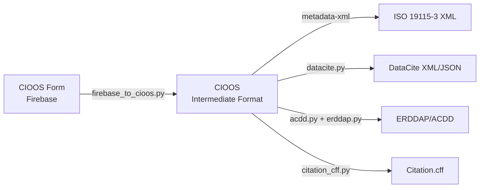

# Metadata Mappings Overview

This section provides comprehensive documentation of how metadata fields are mapped between the CIOOS Form, the CIOOS intermediate format, and various international metadata standards.

## Conversion Pipeline

The CIOOS Metadata Conversion tool uses a two-stage pipeline:



## Available Mapping Documents

### [CIOOS Form to CIOOS](cioos-form-to-cioos.md)

Documents the transformation from the CIOOS metadata entry form (Firebase export) to the canonical CIOOS intermediate format.

**Key transformations**:
- Field restructuring and normalization
- Coordinate transformations (lat,long → long,lat)
- EOV translation (English → French)
- Taxa keyword flattening
- License code resolution
- Contact restructuring
- Automatic distributor assignment

### [CIOOS to ISO 19115-3](cioos-to-iso19115-3.md)

Documents the generation of ISO 19115-3:2016 compliant XML metadata from the CIOOS intermediate format.

**Standard**: ISO 19115-3:2016 Geographic Information - Metadata
**Implementation**: Via `metadata-xml` package using Jinja2 templates

**Key features**:
- Bilingual metadata using PT_FreeText
- Complete geographic extent support
- Platform and instrument acquisition information
- Resource lineage and history
- Responsible party details with roles

### [CIOOS to DataCite](cioos-to-datacite.md)

Documents the mapping to DataCite Metadata Schema 4.5 for research data citation and DOI registration.

**Standard**: DataCite Metadata Schema v4.5
**Output formats**: XML and JSON

**Key features**:
- DOI-focused metadata structure
- Creator and contributor mappings
- Funding information
- Related identifiers
- Geolocation support

### [CIOOS to ERDDAP/ACDD](cioos-to-erddap-acdd.md)

Documents the generation of ERDDAP global attributes following ACDD 1.3 conventions.

**Standard**: ACDD 1.3 (Attribute Convention for Data Discovery)
**Use case**: ERDDAP data servers, NetCDF files

**Key features**:
- CF conventions compliance
- Vocabulary-based keywords
- Platform and instrument metadata
- Contact information as attributes
- Multilingual attribute support

## Understanding Field Mappings

Each mapping document provides:

1. **Field-by-field mappings**: Source → Target with processing logic
2. **Data types**: Expected types and formats
3. **Required/optional indicators**: Compliance requirements
4. **Default values**: When fields are missing
5. **Special processing**: Transformations, lookups, validations
6. **Examples**: Sample input/output for clarity

## Common Mapping Patterns

### Bilingual Fields

Most text fields support bilingual content (English/French):

**CIOOS Form**:
```json
{
  "title": {
    "en": "English Title",
    "fr": "Titre français"
  }
}
```

**CIOOS Intermediate**:
```yaml
title:
  en: "English Title"
  fr: "Titre français"
```

**ISO 19115-3 Output**:
```xml
<cit:title>
  <gco:CharacterString>English Title</gco:CharacterString>
  <lan:PT_FreeText>
    <lan:textGroup>
      <lan:LocalisedCharacterString locale="#en">English Title</lan:LocalisedCharacterString>
    </lan:textGroup>
    <lan:textGroup>
      <lan:LocalisedCharacterString locale="#fr">Titre français</lan:LocalisedCharacterString>
    </lan:textGroup>
  </lan:PT_FreeText>
</cit:title>
```

### Contact Information

Contacts are structured with organization and optional individual details:

**CIOOS Intermediate**:
```yaml
contact:
  - roles: [owner, distributor]
    organization:
      name: "Organization Name"
      ror: "https://ror.org/..."
    individual:
      name: "LastName, FirstName"
      orcid: "https://orcid.org/..."
    inCitation: true
```

This maps to appropriate structures in:
- ISO 19115-3: `CI_Responsibility` with `CI_Organisation` or `CI_Individual`
- DataCite: `creators` and `contributors` with affiliations
- ACDD: `creator_*` and `contributor_*` attributes

### Geographic Extent

Spatial coverage can use bounding box or polygon:

**CIOOS Intermediate**:
```yaml
spatial:
  bbox: [-125.0, 48.0, -124.0, 49.0]  # [west, south, east, north]
  polygon: "-125.0,48.0 -124.0,48.0 -124.0,49.0 -125.0,49.0"
```

Maps to:
- ISO 19115-3: `EX_GeographicBoundingBox` or `EX_BoundingPolygon`
- DataCite: `geoLocations` with `geoLocationBox` or `geoLocationPolygon`
- ACDD: `geospatial_bounds` and `geospatial_*` attributes

### Keywords and Vocabularies

Keywords are organized by vocabulary:

**CIOOS Intermediate**:
```yaml
identification:
  keywords:
    default:
      en: ["keyword1", "keyword2"]
    eov:
      en: ["oxygen", "nutrients"]
    taxa:
      en: ["Animalia", "Mollusca"]
```

Maps to:
- ISO 19115-3: Multiple `MD_Keywords` blocks with thesaurus names
- DataCite: `subjects` with optional `subjectScheme`
- ACDD: Comma-separated `keywords` with prefixes and `keywords_vocabulary`

## Validation and Compliance

Each mapping document includes information about:

- **Required fields**: Mandatory elements for standards compliance
- **Controlled vocabularies**: Valid values from codelists
- **Format requirements**: Date formats, identifiers, URLs
- **Cardinality**: Single vs. multiple values
- **Conditional logic**: When certain fields are included/excluded

## Processing Functions

Common data processing across mappings:

- **Date normalization**: ISO 8601 formatting
- **Coordinate transformation**: lat,long ↔ long,lat
- **Vocabulary lookups**: License codes, EOV codes, EPSG codes
- **Taxonomy flattening**: Hierarchical → flat keywords
- **Empty value removal**: Clean output without nulls
- **Multilingual generation**: Language-specific fields

## Using the Mapping Docs

### For Users

- Understand what metadata will be included in outputs
- Know which form fields map to which standard fields
- Identify required vs. optional metadata
- Learn about data transformations applied

### For Developers

- Understand the conversion logic
- Identify where to make changes for new features
- Find transformation functions to modify
- Understand dependencies between fields

### For Metadata Creators

- Know which form fields to populate
- Understand how data will be used downstream
- Ensure bilingual content is complete
- Validate controlled vocabulary usage

## Next Steps

Choose a mapping document to explore:

- [CIOOS Form to CIOOS](cioos-form-to-cioos.md) - Start here to understand the baseline transformation
- [CIOOS to ISO 19115-3](cioos-to-iso19115-3.md) - Most comprehensive standard
- [CIOOS to DataCite](cioos-to-datacite.md) - For DOI and citation
- [CIOOS to ERDDAP/ACDD](cioos-to-erddap-acdd.md) - For data servers

Or return to:

- [Usage Guide](../usage.md) - Learn how to use the conversion tool
- [CLI Reference](../cli.md) - Command-line interface documentation
